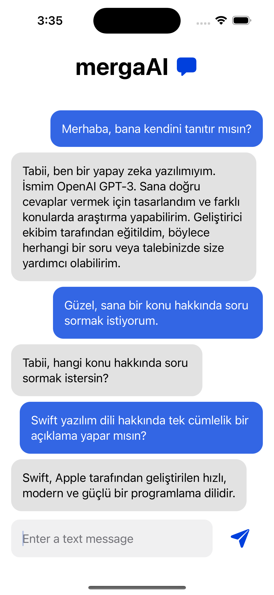

# ChatGPTApp

iOS app where the user can ask questions and get answers with the help of ChatGPT API.

# Features
* You will find answers to your questions with ChatGPT 3.5.
* SwiftUI
* MVVM Architecture

# Pods

```yaml
  pod 'Alamofire'
```

# Screens

